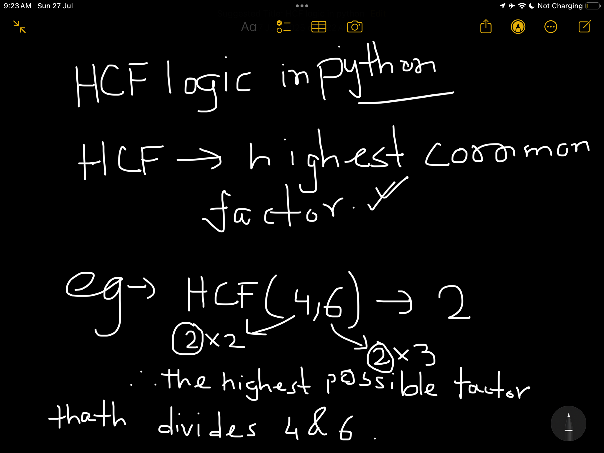
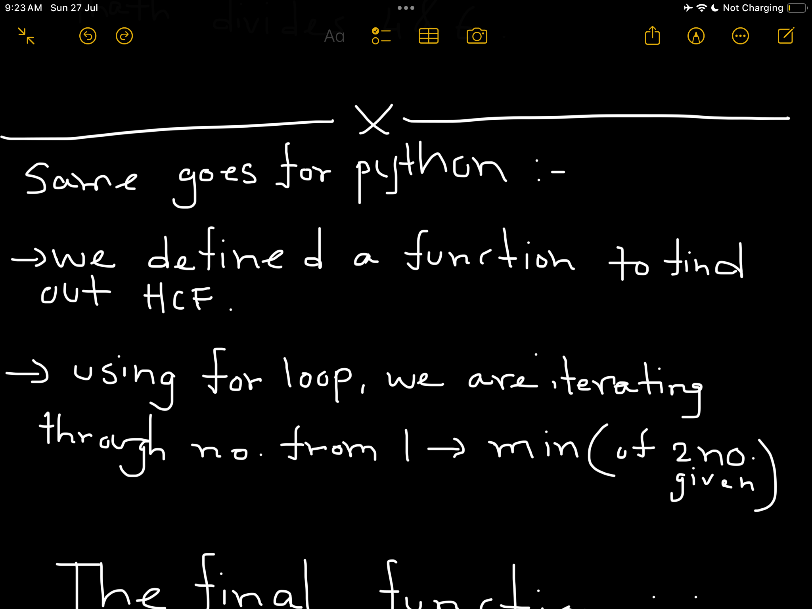
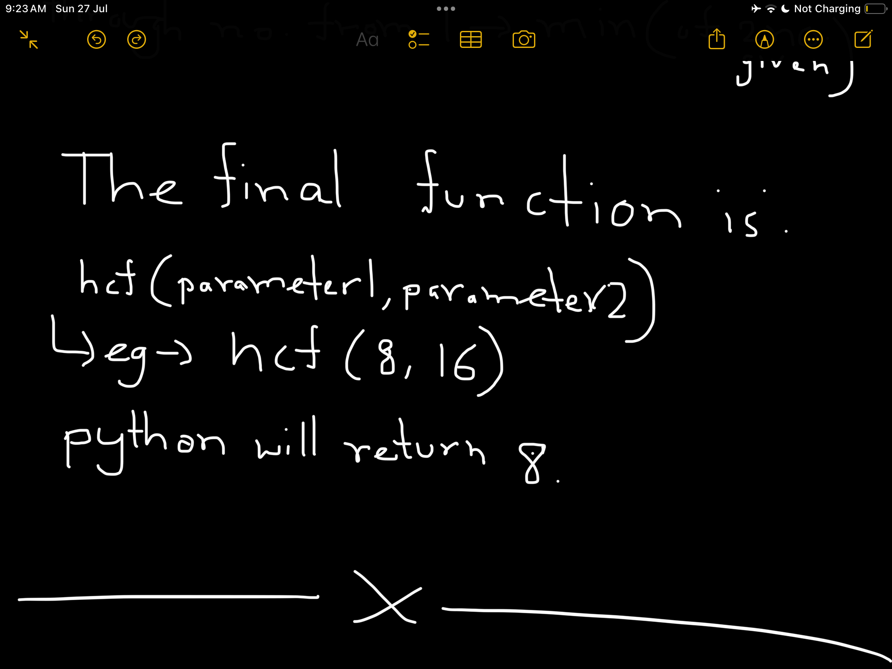
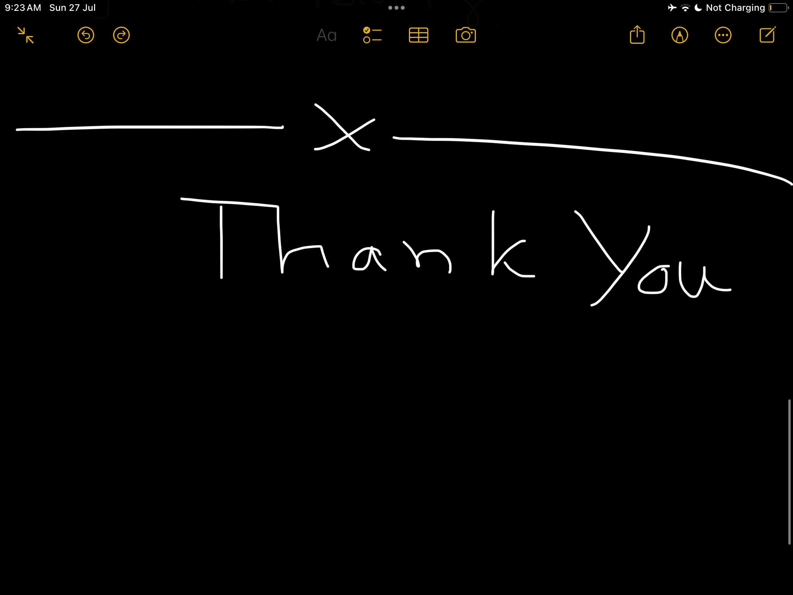

Hello this is a code of hcf checker!
I wrote this code to find our hcf of 2 numbers entered by a user

HCF means the highest possible factor which divides both the numbers leaving no remainder

Same logic goes for python but I made it a little differently
I did not use gcd function directly from math module 
instead i created my own function

Here is the function:

